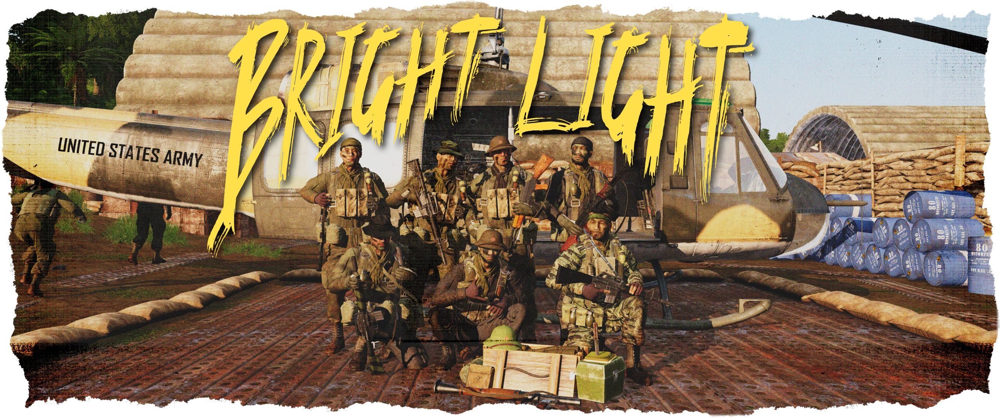

# Search & Rescue in Cam Lao Nam

# Scenario
A spike team was shot down in the middle of enemy territory. Unsurprisingly, the enemy noticed the crash and is closing in. Rumours among GIs say that Dac Cong commando units operate in this AO - special forces trained to hunt down and kill spike teams. Meanwhile, the spike teams distress call was received on the far island of Dharma and preparation are already underway to get the boys out.

# Gameplay
The players are separated into three factions:

## The Spike Team (Independent):

- Starts at a randomly selected crash site
- Main goal is to be rescued by the search team and evade getting killed by the dac-cong commando team
- Has no tracer bullets or smoke grenades , but can create a smoking fire (ACE self-interaction)
- When detected by the opfor KI for more than ~30 seconds, the KI will inform the dac-cong commando team about the approximate location of the spike team
- The explosive specialist of the spike team carries 2 APERS mines
- The spike team will create track markers every now and then which can be found by the search team, but also by the dac cong commandos. [N] tracks cannot be seen while in vehicles!  

## The Search Team (Bluefor):

- Starts on the southern Island of Dharma, near the Maxwell airfield
- Main goal is to find and rescue the spike team by bringing them back to the Maxwell airfield
- The team is composed of two pilots, two door gunners and a squad of five MACV-SOG soldiers
- They have one UH-1D Iroquois Slick and one OH-6A Cayuse at their disposal
- Fuel, ammo and medical equipment is available at the start point, but needs to be transported.
- The search team is equipt with mine detectors

## The Dac Cong Commandos (Opfor):

- Start on a road near the crash site of the spike team
- Main goal is to kill the spike team and everyone helping them
- At the start, the opfor team has two markers on their maps one is their own position and the latter is the approximate position of the spike crash site (The marker showing the own position will not update)
- There are 7 Dac Cong commando units with 2 PAVN soldiers
operating a BTR-40 (DShKM) for mobility
- When the spike team is spotted by friendly KI units the spike position marker will update and a notification is shown
- Ammo and medical supplies are stored in the BTR-40
- The Dac Cong commando have one soldier with an RPG (2 rounds)
- The Dac Cong commandos are equipt with mine detectors

# General Gameplay Hints

- Immersive Map Mod:
Only the vehicle channel is activated. To share markers, a player can put his map on the ground or hold it in hands (toggle map) and other players can look on it via ACE interaction menu. There is also an option to copy the marker to the own map

- Adapted Medical Settings:
  - Tourniquets only take two 2 seconds
  - Cardiac arrest time: 5 minutes
  - Bleeding coefficient: 0.5
  - Surgical Kit: only in medical vehicles - BTR-40 (Opfor) or UH-1D (Bluefor)
- Custom loadouts available for all factions
- Immersive Cigs mod
- The spike team shall not leave the AO
- Only the vehicle commanders and squad leaders have radios
- There are some mission parameters that can be used to balance the gameplay (e.g. opfor distance to spike team, fireplace build time)

# Map

